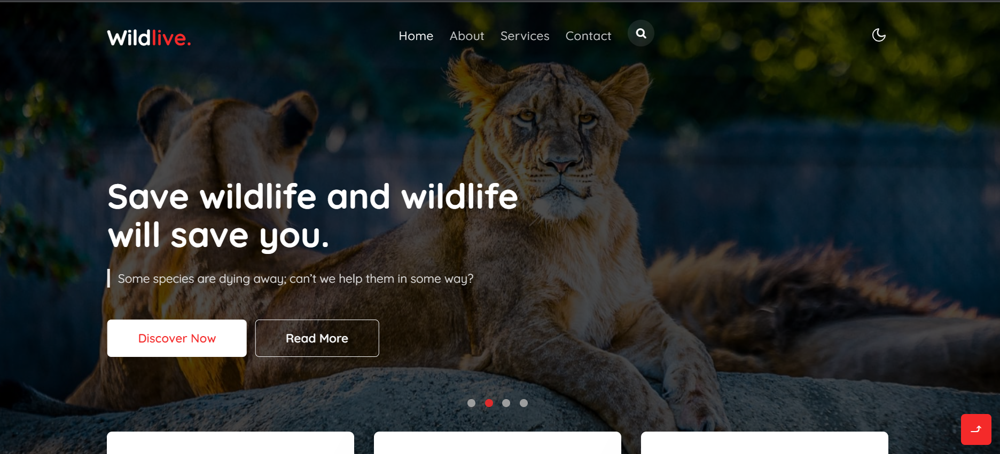

# WilfLive

## What's It is About

By conserving the wildlife and forest we are ensuring that all diverse species in an area survive, breed and flourish. Conservation of wildlife and forests is vital for ecological stability. Forests are the habitat for wildlife and they are an important constituent of the various food chains and food webs.

Due to day by day increasing of hunting and wildlife extinction I made this project to promote importance regarding animal and wildlife.

## Technologies Used

I made this website using html, css and JavaScript. It includes home page, about page, services page and contact page and used Microsoft Azure Technologies to host it on azure using static web app. It is also my final project for Microsoft Future Ready Talent learning.
Azure Link - https://proud-ocean-08f8b1e10.1.azurestaticapps.net/
